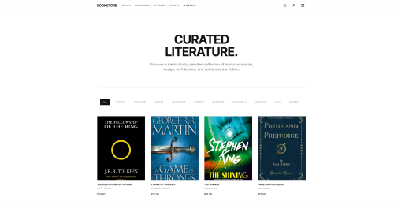

# Book Store


An interactive, highly tested e-commerce frontend built for a modern book-buying experience. This application goes beyond standard shopping cart mechanics by incorporating engaging, interactive user discovery tools.

> **Note:** This repository contains the Frontend React application. The companion Java Spring Boot backend API can be found [here](https://github.com/Caue-Ribeiro/bookstore_api_backend).

---

## 📖 Overview

The Book Store frontend provides a seamless shopping experience with robust global state management and strict client-side routing. Designed to handle authenticated user sessions securely, it features complex UI components including real-time cart mutations, dynamic order tracking, and integrated Stripe payment redirects.

---

## 🎥 Application Demo

[](https://drive.google.com/file/d/1_d-iLgei5JlKa5nqXqxLnR5j4nrwSeVw/view?usp=sharing)

_Click the image above to watch the full walkthrough._

---

## ✨ Key Features

- **The Literary Oracle:** An interactive, multi-stage discovery engine that analyzes user moods/vibes and returns personalized reading archetypes and recommendations.
- **AI Book Judger:** A modal pipeline that playfully "judges" the user's cart contents and suggests alternative literature.
- **Secure Authentication & Profile Management:** Fully protected routes, persistent JWT handling, interactive audit logs, and a highly secure "Danger Zone" account deletion pipeline.
- **Global State Management:** Utilizing Zustand to maintain synchronized, in-memory states for user sessions and shopping cart contents without relying on fragile hard-reloads.
- **Checkout Integration:** Seamless handoff to the Stripe payment gateway for order processing.

---

## 🛠 Tech Stack

**Frontend Environment:**

- **Core:** React 18, TypeScript
- **Build Tool:** Vite
- **Styling:** Tailwind CSS, Lucide React (Icons)
- **State Management:** Zustand
- **Routing:** React Router DOM
- **Data Fetching:** Axios
- **Testing:** Playwright (End-to-End)

**Backend Integration:**

- Communicates with a Spring Boot REST API backed by PostgreSQL.

---

## 🚀 Getting Started

To run this application locally, you will need Node.js installed on your machine.

### 1. Clone the repository

```bash
git clone [https://github.com/YourUsername/book-store-frontend.git](https://github.com/YourUsername/book-store-frontend.git)
cd book-store-frontend
```

### 2. Install dependencies

```bash
npm install
```

### 3. Environment Setup

```
VITE_PUBLISHABLE_STRIPE_KEY=pk_test_your_stripe_public_key_here

VITE_API_URL=http://localhost:8080
```

### 4. Start the development server

```bash
npm run dev
```

The application will typically be available at http://localhost:5173.

---

## 🧪 Testing

This project places a heavy emphasis on reliability and utilizes Playwright for comprehensive End-to-End (E2E) testing. The test suite covers complex Single Page Application (SPA) routing, protected routes, and interactive multi-step modals without losing global state.

To run the test suite:

```bash
# Run all tests in headless mode
npx playwright test

# Run tests with the Playwright UI (Recommended for debugging)
npx playwright test --ui
```

---

## 👤 Author

### Cauê Ribeiro

#### GitHub: @Caue-Ribeiro

#### Site: https://caueribeirodev.vercel.app/

#### LinkedIn: https://www.linkedin.com/in/cau%C3%AA-ribeiro-647b07240/

## 📄 License

This project is licensed under the MIT License - see the LICENSE file for details.
